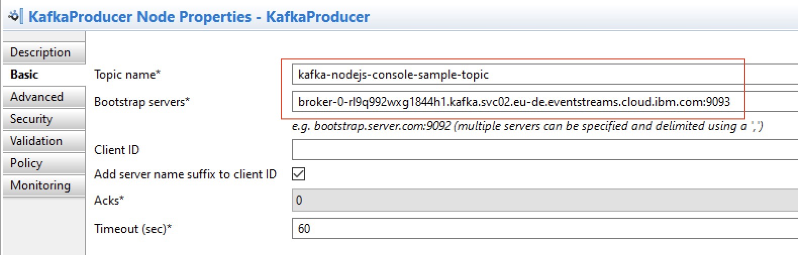
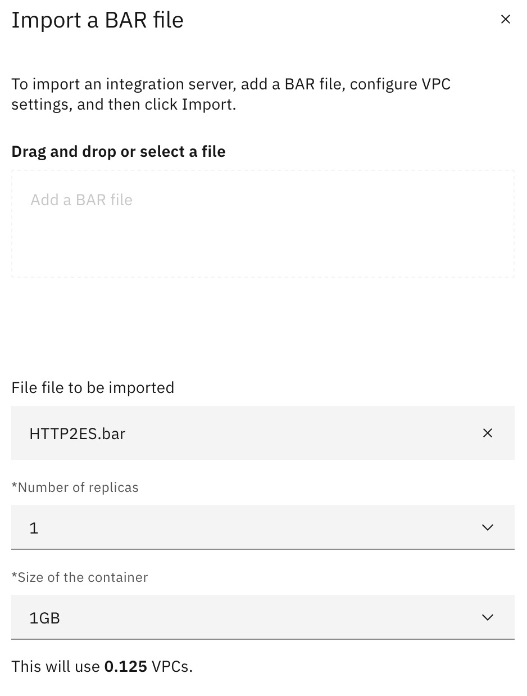
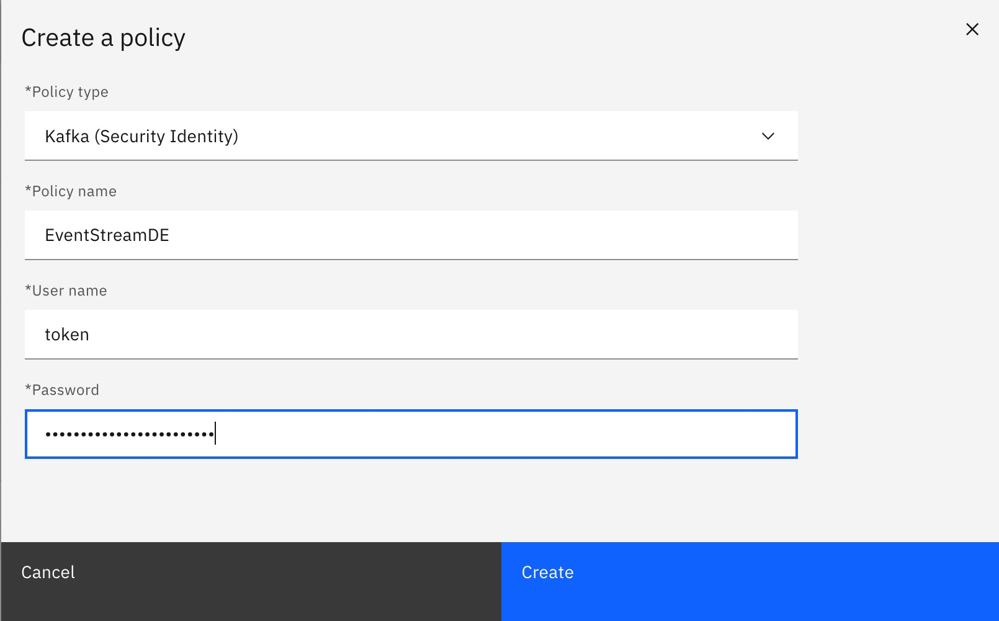
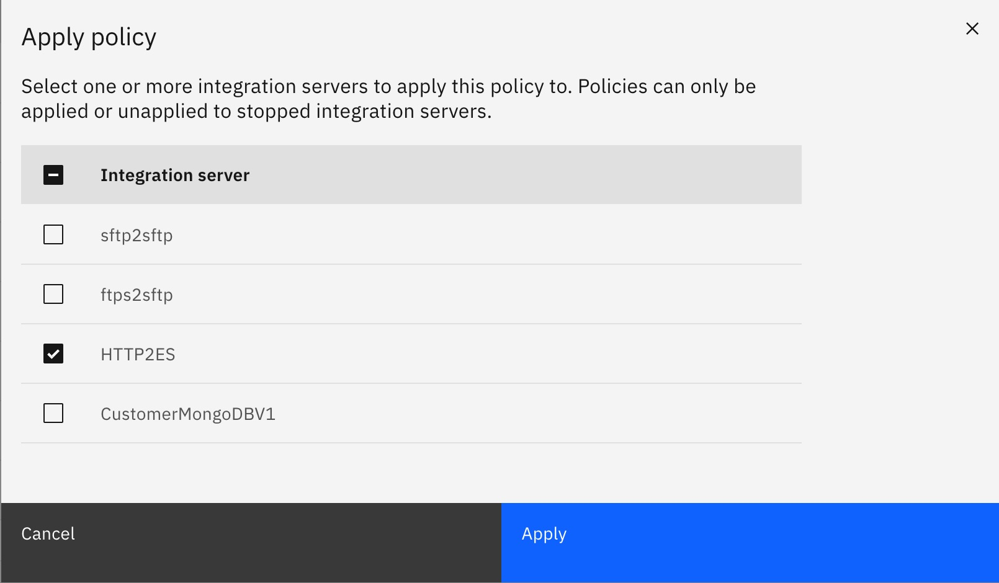
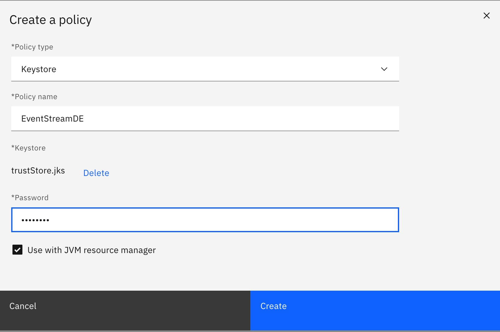
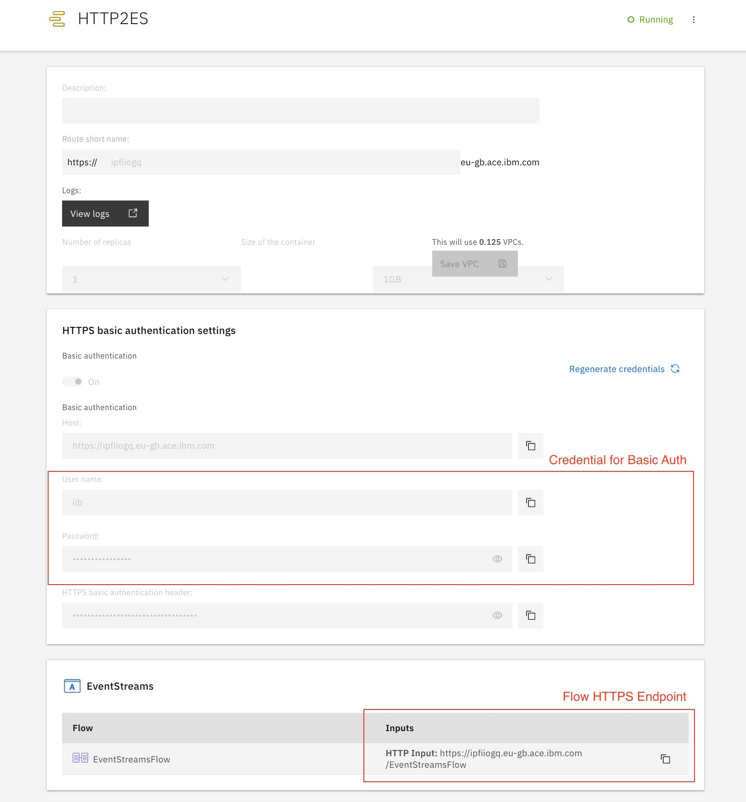
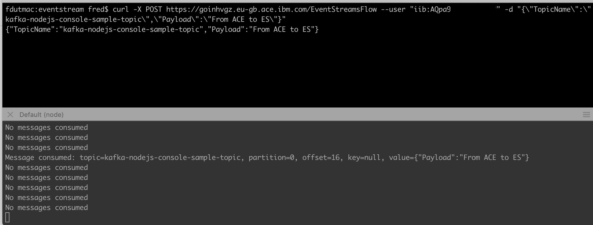

# Sending Kafka data to IBM Event Streams using ACE

This demo helps you learn how to connect App Connect Enterprise to IBM Event Streams. Apache Kafka is an open source project that provides a messaging service capability, based upon a distributed commit log. It lets you publish and subscribe data to streams of data records (messages). 


For this we will be using eventStream service available in IBM Cloud : https://cloud.ibm.com/catalog/services/event-streams

## Requirement

- Create IBM EventStream service in IBM Cloud : https://cloud.ibm.com/catalog/services/event-streams
- Install App Connect Toolkit : https://developer.ibm.com/integration/docs/app-connect-enterprise/get-started/

## Import and update Flow in App Connect Toolkit

- Import the provided project interchange file into your ACE Toolkit’s workspace [here](resources/PI_EventStreams.zip). You will find an application called EventStreams which contains a message flow named EventStreamsFlow. 


>Note: The purpose of this flow is to receive a simple JSON message over HTTP, which contains the name of a Kafka topic and some payload data. The KafkaProducer message flow node sends the payload to the provided topic. Look at the KafkaProducer node’s properties. 

- You will need to change the Bootstrap servers property to refer to your IBM Event Streams system and the Topic name on the message flow node. 

- Retrieve Bootstrap server endpoint in service credential of your Event Stream service instance
  https://cloud.ibm.com/docs/EventStreams?topic=EventStreams-connecting



>Note: This will be overridden based on the HTTP data which is sent into the message flow. The security properties have already been pre-configured for you to specify SASL_SSL and TLSv1.2. 


- For secure connection with EvenStream, open the file server.conf.yaml of you test ACE Server in your favoured text editor. Locate the ResourceManagers … JVM section, and uncomment the truststore properties and assign the following values (Replace with your values):

```
ResourceManagers:
  JVM:
    truststoreType: 'JKS'
    truststoreFile: 'C:\data\truststore\trustStore.jks'
    truststorePass: 'MyServer::truststorePass'
```

The JKS certificate file which is placed into the ACE trust store, is used by ACE to verify the certificate which is presented by IBM Event Streams during the handshake when an SSL connection is made. The file trustStore.jks is a copy of the server-side public certificate which you can download from IBM Event Streams. When you download the jks file, by default it is protected by a simple password which is the value password but you will want to change this, or export the certificate and import it into your own trust store using a tool such as keytool.

We will provide these passwords to the ACE Toolkit Test Server in the commands which follow:

`mqsisetdbparms -w C:\Users\FredericDutheil\workspace\ace\sandbox\TEST_SERVER -n MyServer::truststorePass -u thiscanbeanyvalue -p xxxxx`

`mqsisetdbparms -w C:\Users\FredericDutheil\workspace\ace\sandbox\TEST_SERVER -n kafka::KAFKA -u token -p "hmHbWpFWewExxxxxxxxxxxxxxx"`

## Test Flow in App Connect Toolkit

- Deploy the message flow to your stand-alone ACE Toolkit Test Server. 

- Test the message flow by sending it data using curl or an equivalent HTTP testing client. The example below assumes that your IBM Event Streams topic is called *kafka-nodejs-console-sample-topic*:


   `curl -X POST http://localhost:7800/EventStreamsFlow -d "{\"TopicName\":\"kafka-nodejs-console-sample-topic\",\"Payload\":\"From ACE To EvenStream\"}"`

- Consume message with one of sample provider here : https://github.com/ibm-messaging/event-streams-samples


## Deploy Bar file in IBM App Connect on IBM Cloud

- Create and export BAR File from ACE Toolkit

- Create IBM App Connect service in IBM Cloud : https://cloud.ibm.com/catalog/services/app-connect

> Note: You can use Lite Plan

- Import BAR File in App Connect on Cloud



- Create a **Kafka** policy



- Apply policy to the Integration Server associated with the Bar file previously imported.



> Notes:  May be you need trustStore certificates for eventStream secure connection.
> Create a KeyStore Policy with your trustStore and associate it with the JVM. Next apply the policy with the integration server




- Start Server

- You need to use basic Auth for Https connection.



- Test your Flow

`curl -X POST https://goinhvgz.eu-gb.ace.ibm.com/EventStreamsFlow --user "iib:AQpa92XXXXXXXX" -d "{\"TopicName\":\"kafka-nodejs-console-sample-topic\",\"Payload\":\"From ACE to ES\"}"`

- Consume message with one of sample provider here : https://github.com/ibm-messaging/event-streams-samples

For example with nodejs *[kafka-nodejs-console-sample](kafka-nodejs-console-samplep)* :

`node /Users/fred/Workspace/Run/EventStream/event-streams-samples/kafka-nodejs-console-sample/app.js broker-0-rl0p123zxg1844h1.kafka.svc02.eu-de.eventstreams.cloud.ibm.com:9094 hmHbWpFWewEfi2oXXXXXXXXxa_dLDnsuBS /usr/local/etc/openssl/cert.pem -consumer`



# Resources
- Connecting App Connect Enterprise and IBM Integration Bus to IBM Event Streams :
https://developer.ibm.com/integration/blog/2018/10/01/connecting-app-connect-enterprise-and-ibm-integration-bus-to-ibm-event-streams/

- To import pem certificates in jks keystore :
https://github.com/alastairmccormack/keyutil

    Example : `java -jar keyutil-0.4.0.jar --new-keystore trustStore.jks --password password --import-pem-file escert.pem`

---
frederic dutheil - 2020