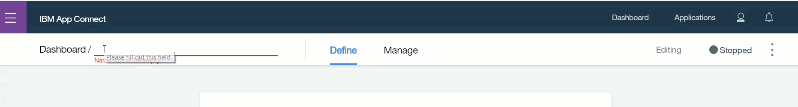
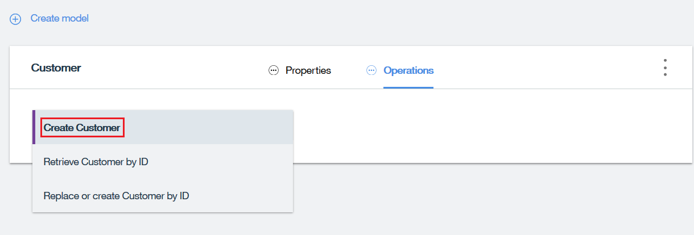
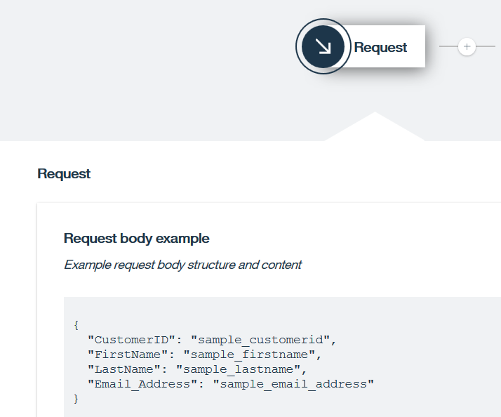
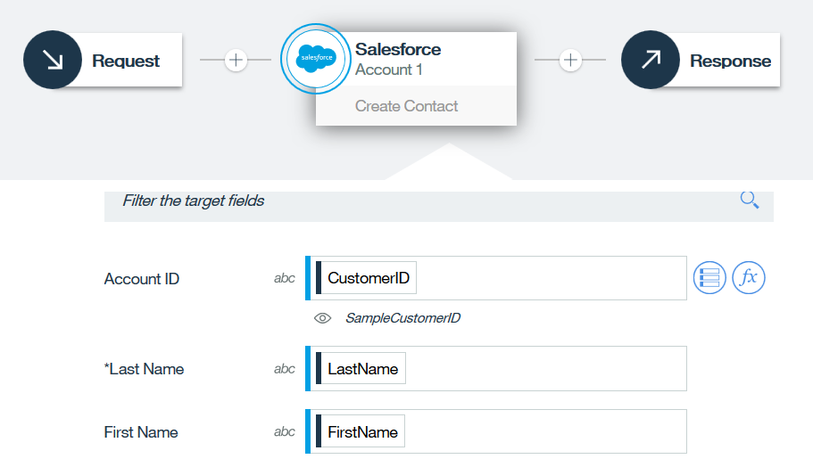
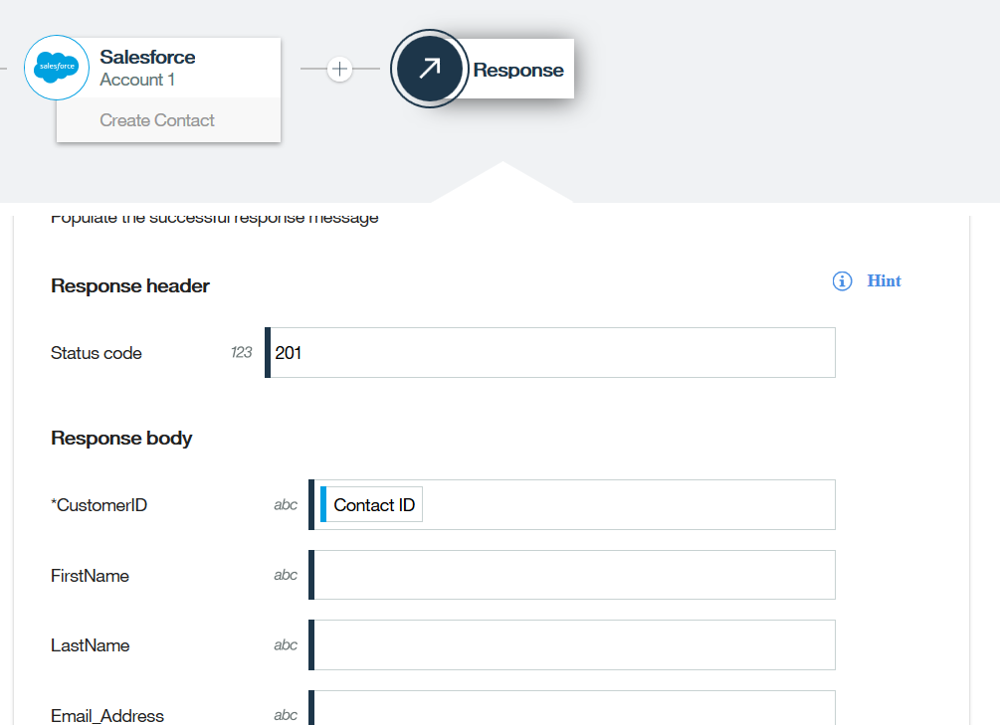
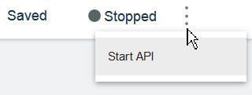
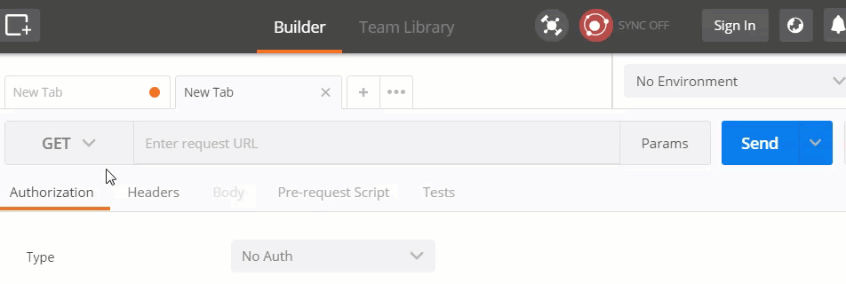
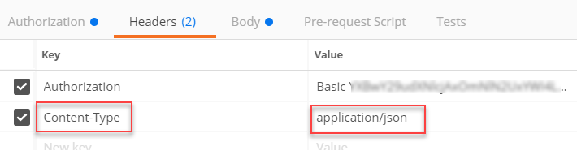
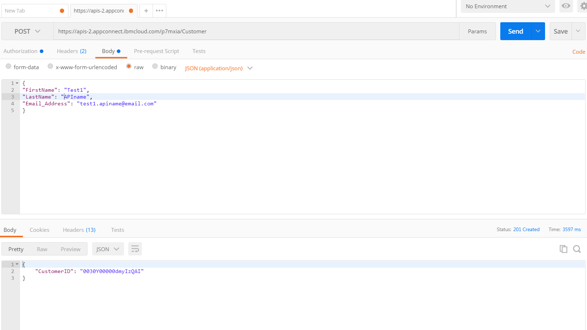
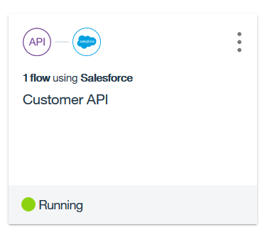

# App Connect : Creating flows for an API

A flow for an API contains a request, one or more target application actions, and a response for an API operation. The flow is triggered by calling the API operation such as from mobile and web applications.

If you want a developer to be able to create an app that makes use of the data in your applications, you can provide an API. For example, you might provide an API that can create, retrieve, and update customers in your CRM system. Defining the API involves the following steps:

1. You create one or more models that define the structure of the objects that you want to create or retrieve.

2. You choose the create, retrieve, or update operations to perform against each model.

3. You configure a flow that implements each operation, adding one or more target applications that hold the data.
4. 
The following steps describe how to create a flow for an API in App Connect to create a Salesforce contact.

## First, find or create everything you need:

(If you haven’t already connected App Connect to your Salesforce account) The name and password of your Salesforce account.

**Note**: If you want to create a free test account in Salesforce rather than use your business account, make sure that you register for a Developer account from this URL: https://developer.salesforce.com rather than a Trial account. If you connect to App Connect with a Trial account, the Salesforce events do not work.

## Next, create the flow for the API:

1. On the Dashboard, click **New** > **Flows for an API**.

2. At the top of the page, enter a name that identifies the purpose of your API, for example: Customer API.



3. In the Model name field, you need to enter a name for your model that reflects the type of object that your API will work with.

The API flow that we are going to create will create a customer in Salesforce. So, in the Model name field, type Customer.

4. Click Create model. The Customer model panel is displayed.

This panel contains 2 tabs; a Properties tab and an Operations tab. First we’re going to work with the Properties tab. Properties are required to define the structure of the object that the API will work with.

5. Our API will create, update, and retrieve a customer so we’re going to use the following properties to identify customers.

	* CustomerID
	* FirstName
	* LastName
	* Email_Address

Add these properties to the Customer model. (To add the first property, type the name in the field provided. To add another property to the list, click (+) Add a property).


>A valid property name has the following characteristics:
>
	* Each property name must be unique.
	* A property name can’t contain spaces, but you can use an underscore character (_) to separate words.
	* It must contain only letters, numbers, or the underscore character.
	* It must contain at least 2 characters.
	* It must begin with a letter or an underscore.

> Tip: You can either type in the name of a property, or click Select properties from applications to choose properties from one or more of the applications that you’re connected to.

1. By default, the first property that you add has the ID option selected. As we want our flow to return a customer ID when we create the customer object, we’ll leave this default.

>**Info**: A property that is set as the ID indicates that your flow must return this property when creating an object or that the property must be sent in a request to update or retrieve an object by using its ID. You can only use ID against one property.

>**Info**: You can create more models by clicking Create model. To delete a model, select Delete model from the menu.

To define how the API will interact with the object, click **Operations**. You can add operations to:

* Create an object.
* Retrieve an object by using its unique ID.
* Update or create an object, where the object is updated if it exists, or created if it doesn’t.

1. Add the **Create Customer operation** to the Customer model. (Click the field “Select an operation to add”, and then select **Create Customer**.)



**Info**: You can define your own operations, by clicking Add a custom operation. Note the following restrictions if you decide to use this option:
* The operation name can’t be a keyword.
* The operation name can’t be one of the following keywords: create, updateOrCreate, all, updateAttributes, update, updateAll, upsertWithWhere, replaceOrCreate, replaceById, destroy, destroyAll, executeAssembly.
* The query parameter can’t be the same as the model ID.

For more information about adding custom operations see, Create your own custom HTTP operations on API flows. ( https://developer.ibm.com/integration/blog/2017/10/24/create-custom-http-operations-api-flows/ )

Next, we’re going to create a flow that defines how the **Create Customer** operation will work.

1. Click **Implement flow**. You’ll see a basic flow in the flow editor, with a **Request**, a **Response**, and a space to add one or more target applications. Notice the the structure of the Request body example, it is constructed from the properties in your model, with some sample data.



1. To add the target application to the flow, click (+).

2. Select Salesforce > Contact > Create contact. (If you haven’t already connected App Connect to Salesforce, specify the name and password of your Salesforce account.)

3. Map the fields from the request into ‘Salesforce / Create contact’ as follows:
	* Account ID: Click within the field and click Insert a reference Insert a reference icon. Then select CustomerID from the Available inputs list.
	* Last Name: Type last and then select LastName from the list.
	* First Name: Type fir and then select FirstName from the list.
	* Email: Type em and then select Email_Address from the list.


	
> **Info**: You can also add some conditional logic to your flow. If you want your flow to do different things for different conditions, you can add one or more “If” nodes to your flow. For more information, see How do I add conditional logic to a flow?

13. Click the **Response** in the flow to define the response that’ll be returned when the operation has completed successfully. Map the available fields from ‘Salesforce / Create contact’ to the response as follows: For the required response field ‘CustomerID’, map the Salesforce field ‘Contact ID’; optionally, map other fields to return their values in the response.



> **Info**: In the Response header section, you can choose your own response code mapping. The following response codes are returned for the different operations:
	* Create operations return a response code of 201 (record created).
	* Retrieve operations return a response code of 200 (record retrieved).
	* Replace or create operations return a response code of 200 (record replaced) or 201 (record created).

1. Click Done to return to your model.
1. From the options menu (⋮), click Start API.




## Finally, test the flow for your API:

If you are using App Connect on IBM Cloud, you can test the flow for your API in the API portal. Otherwise, you can test the flow for your API in your preferred method for invoking an API, such as by using Postman or curl.

### Testing in the API portal

1. On the Manage tab, scroll down to ‘Sharing Outside of Cloud Foundry organization’ (at the bottom of the page).

2. Click Create API Key, give the API a descriptive name; for example: Customer API test, and then click Create.


3. Copy the API key.

4. Click the ‘API PORTAL LINK’ link. This opens the API in an API portal window.

5. To invoke your API in the API portal, click Try it.

6. In the ‘X-IBM-Client-ID’ field, paste the API key.

7. In the ‘data’ field, provide valid customer data in the form:

	```
	{
	"FirstName": "Test1", 
	"LastName": "APIname", 
	"Email_Address": "test1.apiname@email.com" 
	}
	```

8. Click **Call operation**.

9. Scroll down to the Response section, where you should see the success code: 201 Created and the response body containing the CustomerID value assigned by Salesforce.

	```
	Response
	Code: 201 Created
	Headers:
	...

	{
	  "CustomerID": "0035800001EdvprAAB"
	}
	```
	
### Testing in Postman

In this example, we test a flow for an API that was created and started in App Connect purchased from IBM Marketplace: https://designer.appconnect.ibmcloud.com/.

1. To test your API, click the **Manage** tab and make note of the URL, user name, and password. We’re going to use these credentials to invoke the API operations. In this tutorial, we’re going to use *Postman*; however, you can use your preferred utility, for example, the Linux command line and *curl*, or the *HttpRequester add-on for Firefox*.

1. Open the Postman utility. (The following steps use Postman version 5.3.1. Some steps might differ slightly for different versions.)

1. First we’re going to test the **Create Customer** operation by selecting the **POST** function in Postman.

1. In the Enter request URL field, paste the API base URL that you copied earlier and append the model name /Customer to the end.



5. In the **Authorization** tab, change the Type to **Basic Auth**.

6. Add the user name and password that you copied earlier to their respective fields.

7. Click **Update Request**.

8. Go to the **Headers** tab and select the following 
key/value pairs:
	* Key: Content-Type
	* Value: application/json
	



9. Go to the **Body** tab, select **raw** and add the following text to the palette:

	```
	{
	"FirstName": "Test1",
	"LastName": "APIname",
	"Email_Address": "test1.apiname@email.com"
	}
	```
	
**Info**: Note that the request body doesn’t include the API ID property (CustomerID) because that’s set by Salesforce.

10. Click **Send**.

11. The response is posted in the Response palette as displayed in the following image. When you’re creating an object, typically only the ID from the target application will be returned in the response message.



12. Open Salesforce and you’ll notice that a new contact has been created.

13. To manage your API, go back to the API flow in App Connect UI and click the **Manage** tab. Then click **Download API** to download your API document. Note that the file is saved as swagger.json. After you have downloaded the API, you can import it into your API management tool. We’ve provided the URL, user name, and password that your API management tool will need.

You’ve created your API! On the App Connect dashboard, flows for APIs are identified by the API icon. You can start and stop them in the same way as any other flow. You can open an API while it’s running, but you have to stop it before you can edit it.




If you want to find out how to retrieve and update Salesforce contacts using the same API, see Creating flows for an API (Part 2). https://developer.ibm.com/integration/docs/app-connect/tutorials-for-ibm-app-connect/creating-flows-api-part-2/


# Resources :

https://developer.ibm.com/integration/docs/app-connect/tutorials-for-ibm-app-connect/creating-flows-api/

