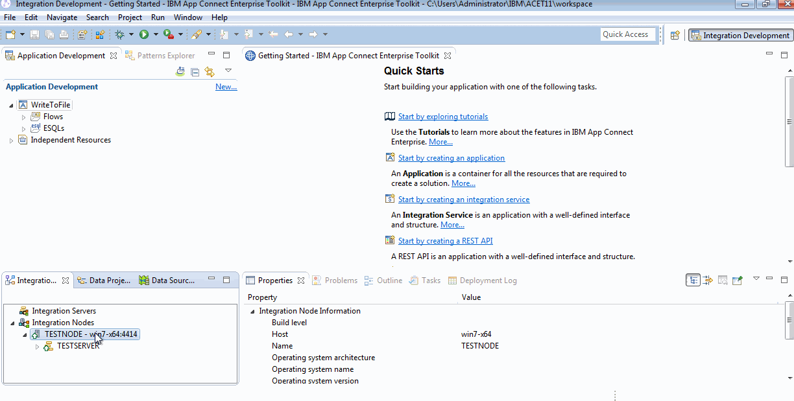
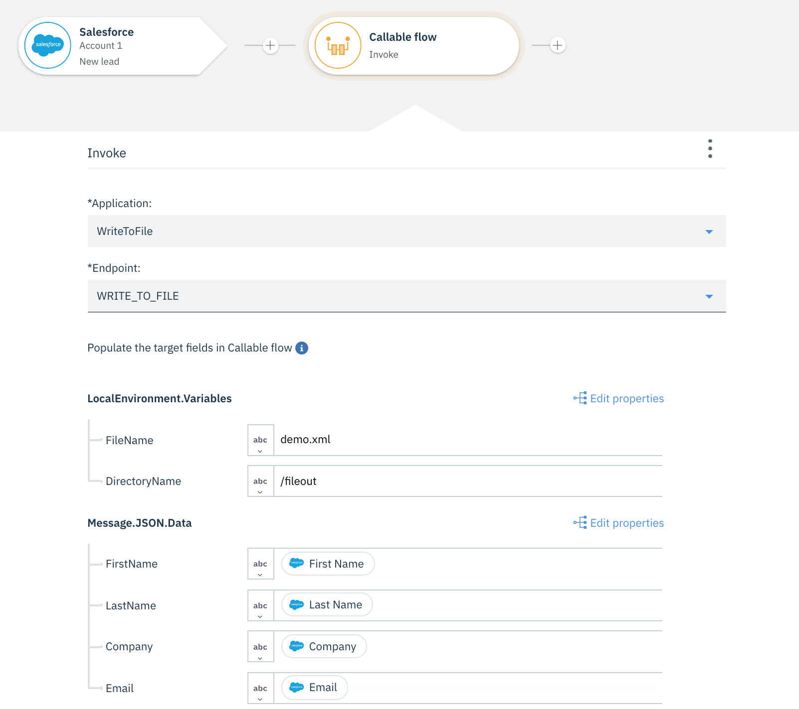

## About this tutorial

Your company is starting to use Salesforce for its Sales reps to record customer leads that they find. 

In the past, all customer-related sales information has been stored in an on-premises custom sales application. 

The on-premises system still needs to have a record of all the leads found by the sales reps, but they don’t want to have to enter the data in both systems. 

In time, the Salesforce system will take over more and more of the on-premises application processing but for now, both applications need the lead information. 

Integrating these two systems requires a hybrid integration approach where some of the integration function runs in the cloud and some must run on premises. 

App Connect Enterprise provides exactly this capability, being able to split the integration seamlessly between the cloud and on-premises system, without the need to define special interfaces or expose the on-premises system directly to the public internet.


In this tutorial you learn how to use IBM App Connect Enterprise to create an event-driven flow that creates a lead in an on-premises sales system with a file-based interface whenever a lead is created in Salesforce.

## Import WriteToFile project in App Connect Toolkit


- Open App Connect Enterprise Toolkit. Clic on App Connect Enterprise Toolkit icon

- Import project named `WriteToFile` in workspace
	- Menu > File > Import > Project Interchange > From zip file > Browse (button)
	- Select file : C:\Student\ACE11\Lab Resources\WriteToFile_PI.zip


## Deploy WriteToFile to App Connect TESTNODE

- Right clic `WriteToFile` project and `Deploy`
- Select **TESTSERVER**


## Open App Connect Web UI

- In App Connect Toolkit 
- Right clic on `TESTNODE` and `Start Web User Interface`




## Import Callable flow WriteToFile in App Connect Designer

Go back in App Connect Designer in IBM Cloud

In IBM AppConnect menu > Manage Callable Flow > Connect Callable flow

- Clic on button `Download the Configuration` and Save file

- Copy the saved file (agentx.json) in the Directory 

```C:\ProgramData\IBM\MQSI\config\TESTNODE\TESTSERVER\iibswitch\agentx  of your "On Premise" App Connect component.
```


- Stop and start the TESTSERVER


And Clic on button `Test your agent`


- Clic on `close` button and retunr on Dashboard and Go back to the Callable flow page to refresh it.

If all id OK, you have a new entry in the list :


### (Optionnal) Set MQSI file root directory environment variable

> 
Set Root Directory environment variable : MQSI_FILENODES_ROOT_DIRECTORY

> Control Panel > System > Advanced System Settings > Environment Variables (button) > New System Variable

>Variable name : MQSI_FILENODES_ROOT_DIRECTORY
>
>Variable value : C:\Output


## Create a new Event Drive Flow

- Clic on Dashboard item


- Clic button `New`and select `Event-Driven flow`


- Give a name to this new workflow
- Add SalesForce `New Lead` action


- Add Callable Flow `WriteToFile` invoke


- Customize Callable Flow action

FileName
DirectoryName


FirstName
LastName
Company
Email


- At the end the result will be something like that



- Next add Salesforce “Update lead” action

	- The final action updates the new lead in Salesforce with data sent back from the called flow running in ACE. 
	- This data is mapped out of the returned local environment from the callable flow.


When you’ve checked everything in the flow (including changing the directory and file name to valid values), open the options menu [⋮] in the banner and click Start flow. 


Then click Dashboard to exit the flow. The flow is now running and ready to be triggered by a new lead in Salesforce.


## Finally, test your flow

- Create a new Salesforce lead:

- Log in to Salesforce using the account that’s connected to IBM App Connect.

- Create a new lead, specifying values for First Name, Last Name, Company, and Email; for example:

Field | Value
------------- | -------------
FirstName | Jean
LastName  | DUBOIS
Company  | ACME


- Save

- Check your flow is running successfully


- Check you have a new file in you output directory with information about the lead you created previously.

- Check the description in the Lead in Salesforce is updated with information about file creation


The video below show all steps :


 