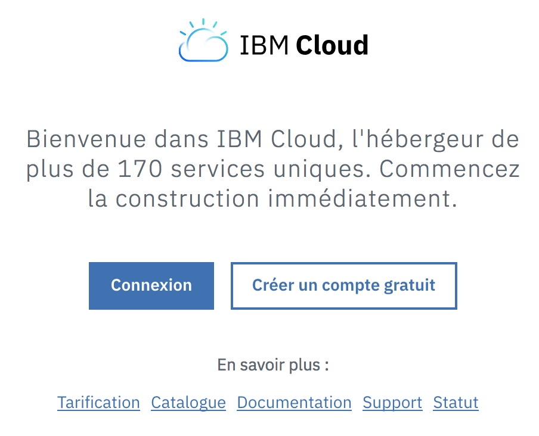
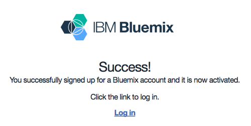
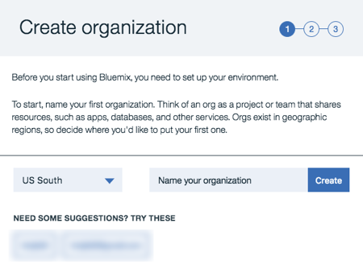
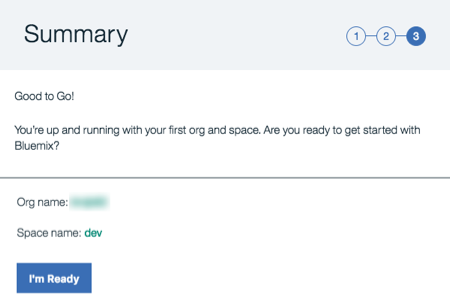
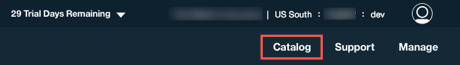
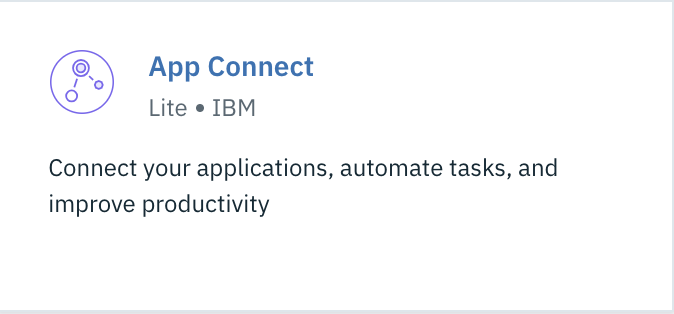
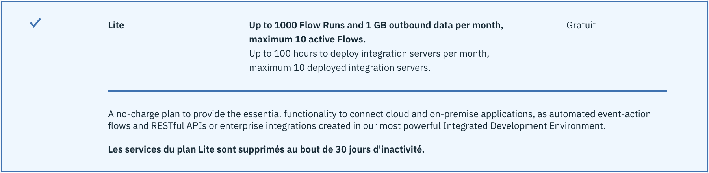
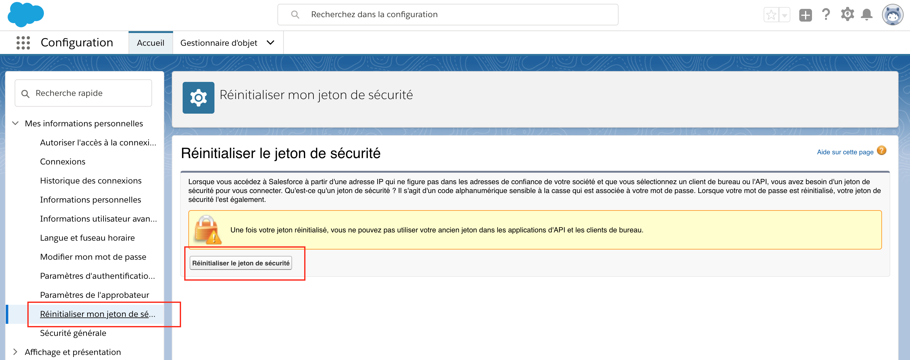

# Prepare your environment

## Create a account on IBM Cloud public

1.  Visit [https://console.bluemix.net/](https://console.bluemix.net/) in your web browser.

1.  Press the `Create a free account` button:

    

1.  Complete the form and press the `Create Account` button.

1.  You will receive an email asking you to confirm your email address. Check your email and click the `Confirm Account` Confirm Account link..

1.  Once confirmed, you will be asked to Log in. Click on the `Log in` link and follow the instructions to enter your credentials and log in. Une fois confirmé, vous serez invité à vous connecter.

    

### Set up your IBM Cloud Organization

1. You will be prompted to **Create organization**. Enter an organization name (notice that there are suggestions for you). Also select an appropriate region. Then press the`Create` button.

   

1. Next you will be prompted to **Create space**. Name your space `dev` and click on the `Create` button.

1. Finally, you will see the Summary page where you can review your entries. Click the `I'm Ready` button.

   

### Browse the Bluemix Catalog and create an App Connect Service

1.  In the top right-hand corner of the screen, select the `Catalog` button to browse the list of available Bluemix offerings.

    

1.  Once in the catalog, you can search for the App Connect service by entering in `App Connect` in the search box next to the magnifying glass icon. Click on the `App Connect` Icon to install a new instance of App Connect into your Bluemix space.

    

1.  You can read through some of the details about the service. Select the Lite pricing plan and click on the `Create button.

    

1.  Once the App Connect service is attached to your account, you will be able to launch the APP Connect dashboard.

 
## Creating a Salesforce.com Developer Account

### Setting up an account

1. Using a web browser go to the URL: http://developer.salesforce.com and click ‘Sign up’.

2. Fill out the form details and submit. You will need a valid email address and you will need to be able to access the email. 

3. Sign into your email account.

4. You will have received an email from Salesforce.com. Access the one with the subject 'Salesforce.com login confirmation' and follow the link to confirm the account setup.

5. Enter a password of your choice.

You now have access to the developer account. Verify the sample data using the following steps.

6. 	In your browser, return to http://developer.salesforce.com and Log into your developer account by clicking the Login button

### Activating Salesforce.com for use with App Connect

1. Login to Salesforce.com. You will see the message requiring activation. If you do not see this message you do not have to activate the laptop.

2. Click 'Send Activation Link'. This will send an email to the email address used for your Salesforce.com account.

3. Access your email and follow the link provided in that email. You will now be able to access your Salesforce.com account from this machine.

### Set and Retrieve the Security Token for Existing Salesforce.com Accounts

If you have an existing Salesforce.com account you will need to activate the laptop to access your Salesforce.com account prior to completing this section. 

1.	Log in to Salesforce.com.

2.	Click your name at the top right of the screen and select ‘My Settings' **Paramêtre**:

3.	Expand the ‘My Personal Information’ menu located on the left side under Personal Setup of the screen and select ‘Reset My Security Token’.  

  

4.	Click the button **'Reset Security Token'**.
 
An email will be sent to your email address. Please access this email and make a note of the security token. You will need this is order to set up the connection from App Connect to your Salesforce.com account.  Note that also every time you change your password, the security token will be changed as well. It is important note that when you copy and paste the token into the endpoint configuration that you trim out any leading or trailing spaces as that might cause authentication errors. 

